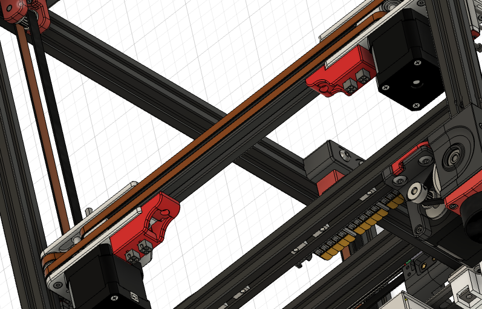
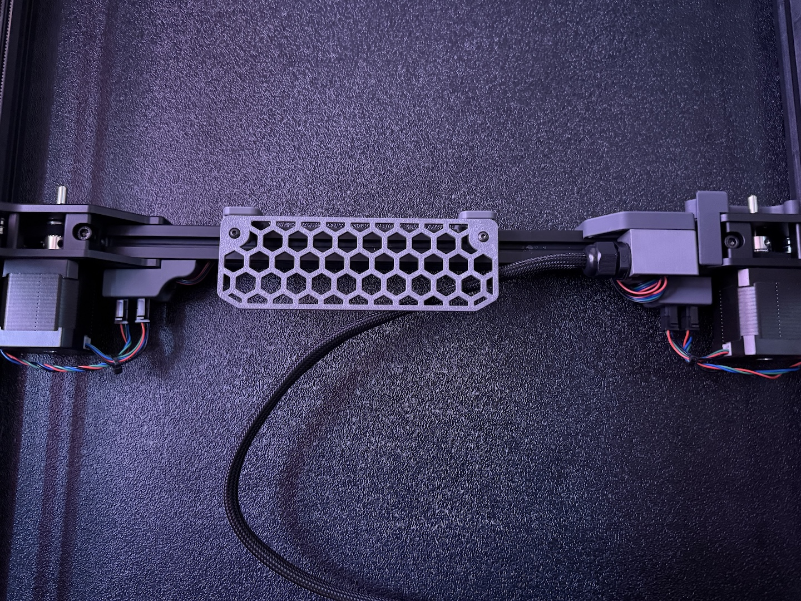

# AABB Microfit3 Pods
Add microfit3 quick connections for AABB motors.

## BOM AWD
| Part | Quantity | Kit Included |
|---|---|---|
| [a]_AABB_Connector_Plug_Microfit.stl | 2 | :x: |
| MicroFit3 2x2 Male w/pin (0430250400) | 4 | :x: |
| MicroFit3 2x2 Female w/pin (0430200409) | 4 | :x: |
| M3x10 SHCS | 2 | :x: |
| M3 Roll-in or hammer nut | 2 | :x: |
| OPTIONAL Ziptie (4mm wide) | 2 | :x: |

I used some extrusion covers from [Front Motor Wiring](../Front_Motor_Wiring) to clean up the wires on the rear x beam

## Credits
The base shape was based on someone else's design but I can't find it in my fiels to give them the proper credits.  It might have been [Ramalama2 AB_Plugs](https://github.com/Ramalama2/Voron-2-Mods/tree/main/AB_Plugs).

## Photos

