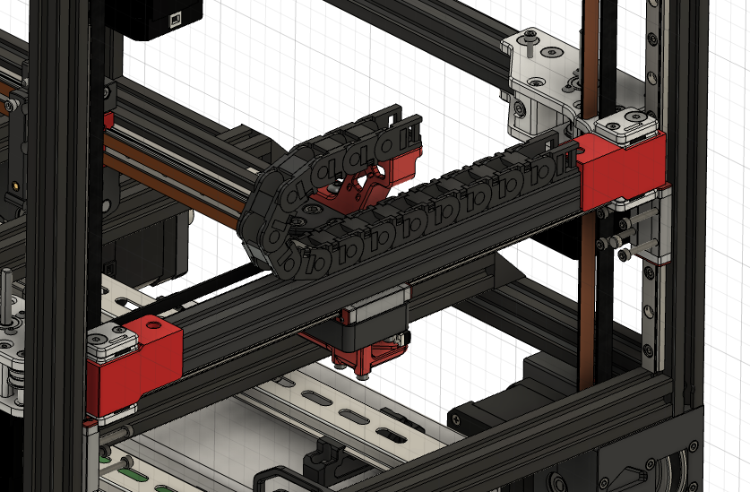
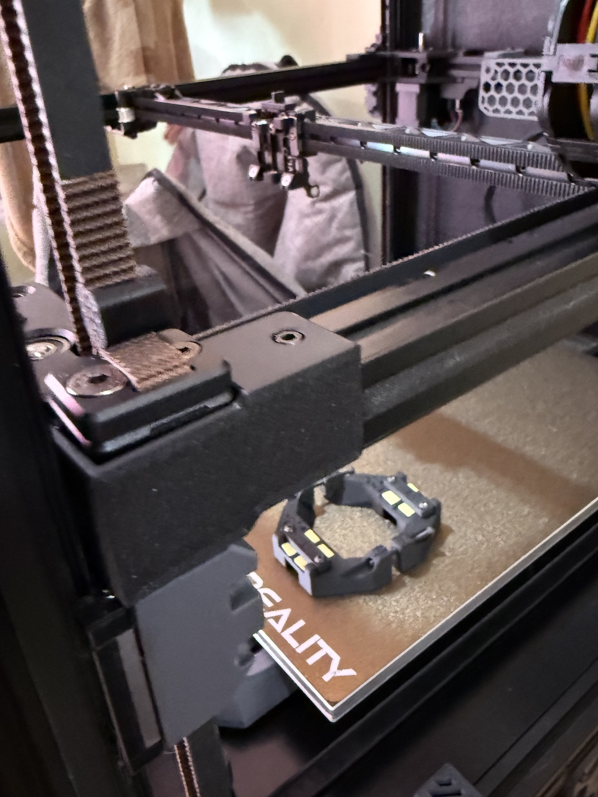
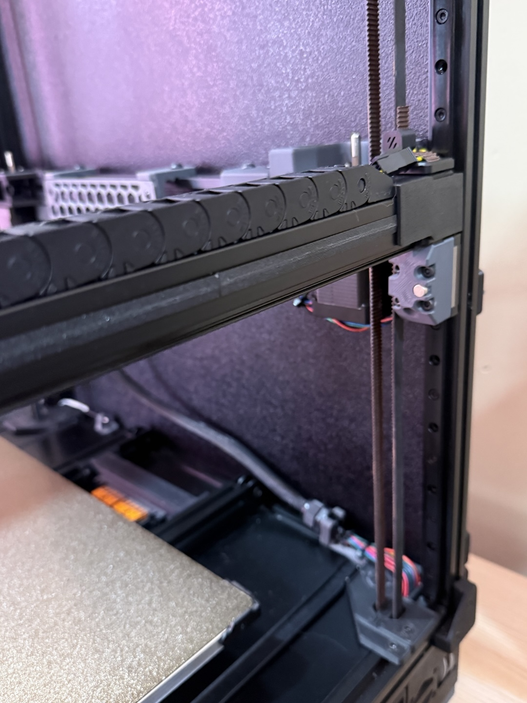
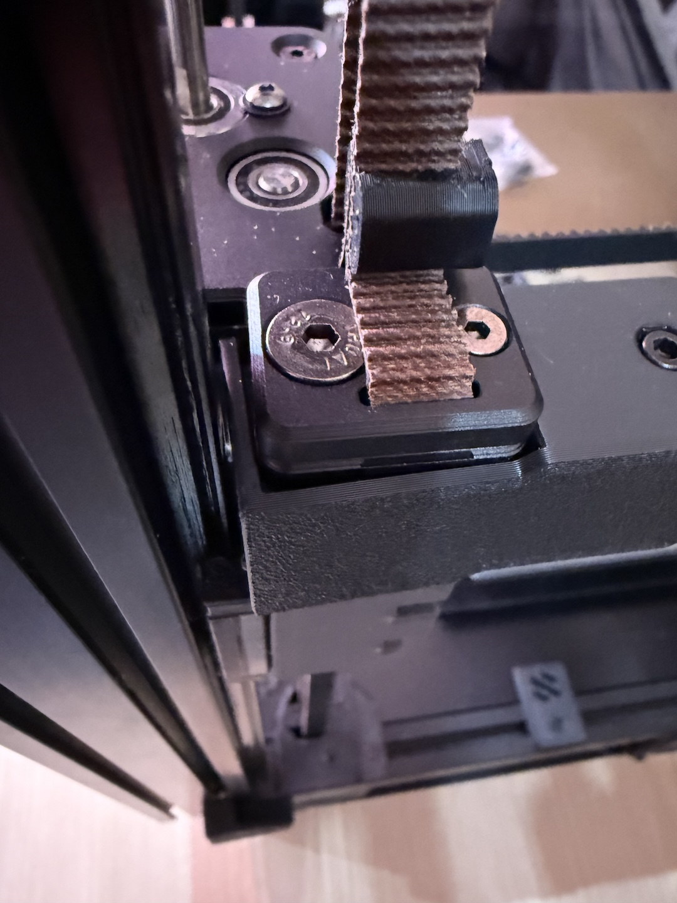
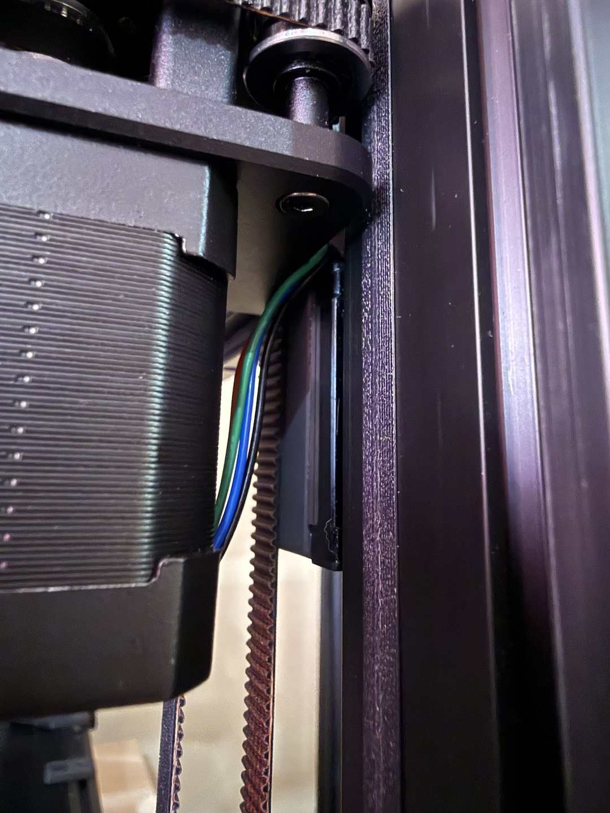

# Front Motor Wiring Covers
Adds some protection and cleans up wiring for the front motors.

## BOM AWD
| Part | Quantity | Kit Included |
|---|---|---|
| [a]_wiring_side_a_x2.stl | 2 | :x: |
| [a]_wiring_side_b_x2.stl | 2 | :x: |
| Extrusion_Cover.stl | scale to fit the gap | :x: |
| M3x8 SHCS | 4 | :x: |
| M3 Roll-in or hammer nut | 4 | :x: |

## Credits
Extrusion_Cover.stl was not designed by me, sadly I've had it so long I can not give proper credits as I can't remember where it's from.  But the print orientation isn't correct. There are many options, this is just the one I used so I included it.

## Photos

