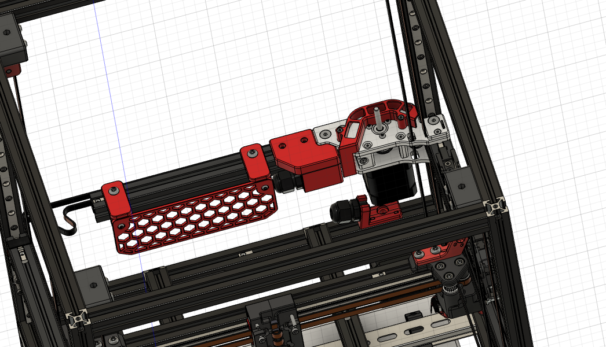
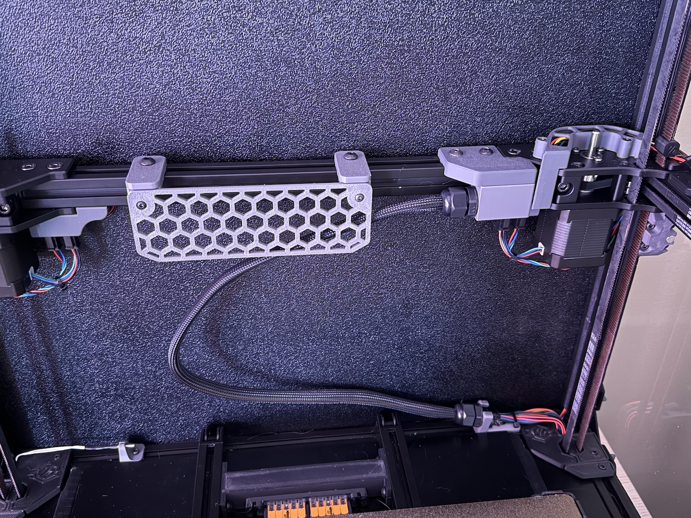

# Zumbilical
Add Zumbilical to replace the Z Chain.  Also made the top piece modular so you can create a PUG version if you'd prefer that.

## BOM
| Part | Quantity | Kit Included |
|---|---|---|
| [a]_horizontal_chain_upper_mount.stl | 1 | :x: |
| [a]_horizontal_chain_lower_mount_PG9.stl | 1 | :x: |
| [a]_horizontal_chain_upper_mount.stl | 1 | :x: |
| PG9 glands | 2 | :x: |
| M3x8 BHCS or SHCS | 3 | :x: |
| M5x8 BHCS | 3 | :x: |
| M3 Heatset | 3 | :x: |
| M5 Roll-in or hammer nut | 3 | :x:|
| OPTIONAL Ziptie (4mm) | 2 | :x: |
| OPTIONAL Wire sleeve (recommended) | length of your zumbilical | :x: |
| **OPTIONAL Fence, but recommended** | | |
| [a]_fence_mount_left.stl | 1 | :x: |
| [a]_fence_mount_right.stl | 1 | :x: |
| [a]_fence.stl | 1 | :x: |
| M3x6 BHCS | 2 | :x: |
| M5x8 BHCS | 2 | :x: |
| M3 Heatset | 2 | :x: |
| M5 roll-in or hammer nut | 2 | :x: |
| **OPTIONAL Y cable cover** | |
| [a]_gantry_cable_cover | Replaces the kit verison | :x: |
| Same screws as kit version | | :heavy_check_mark: |

## Photos

